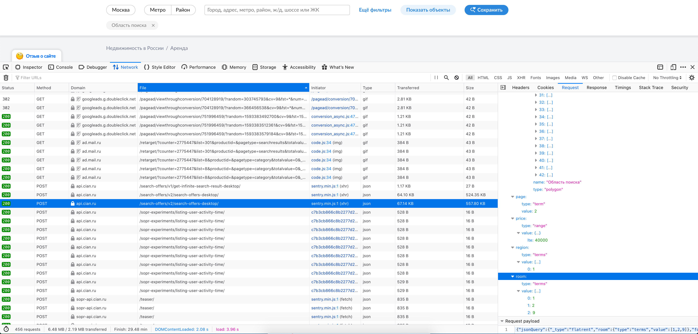

# cian-search

## fetch data from cian

### Usage

```
go run cmd/fetch/main.go [-query=query.json] [-result=result.json]
```

The command takes query.json as a query, fetches and saves result to result.json.

### Query

To obtain custom query, go to cian search and modify query as you like. After that, you need to open developer tools in your browser, and find that request in network tab.

- URL to search: `https://api.cian.ru/search-offers/v2/search-offers-desktop/`
- This is POST request, body is subject.
- In Firefox it can be copied from *Request payload* in right-bottom corner.

My Firefox example:



### Pages

If request contains $page instead of page number, it gets replaced by pages 1 to +inf, until empty page is received. 

### Output format

Output format is plain json array, with json objects. Single array element represents single offer.

## upload data to google sheets

### Init

```bash
```